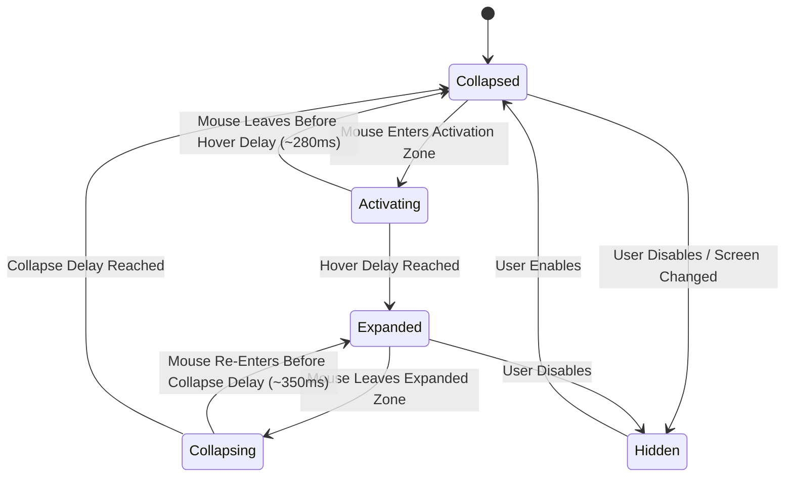

# MacNotch

> **A native, fluid, privacy-first macOS utility integrated seamlessly into the MacBook camera notch.**


-darkgreen?style=flat)

MacNotch turns the MacBook camera housing into an interactive, fluid utility area. Remaining virtually invisible during normal workflow, it smoothly expands when the cursor moves into the notch activation zone—delivering instant access to clipboard history, local weather, live audio controls, and date/time.

---

## 📦 Download & Installation

The drag-and-drop installer disk image is available at:
`./MacNotch.dmg`

1. Double-click `MacNotch.dmg` to mount the disk image.
2. Drag `MacNotch.app` into your **Applications** folder.
3. Launch `MacNotch` from Applications or Spotlight.
4. The utility will automatically integrate with your camera notch and appear in your menu bar.

---

## Highlights

* 🎯 **Dynamic Hardware Notch Detection**: Derives exact geometry directly from `NSScreen.safeAreaInsets`, `auxiliaryTopLeftArea`, and `auxiliaryTopRightArea`. Zero hardcoded model names or screen resolutions. If no notch is detected (external screens, desktop Macs), the visual notch is gracefully omitted while the menu bar companion remains available.
* 📋 **Rich Horizontal Clipboard Manager**:
  * Real-time monitoring of `NSPasteboard.general` via `changeCount`.
  * Automatic content classification: Plain Text, URLs (domain badge), Code snippets (monospace formatting), Images (thumbnail preview), and File paths.
  * Consecutive duplicate prevention and heuristic sensitive-credential filtering (API keys, private keys, password-manager transient types).
  * 100% local persistence with configurable retention (50, 100, 500, unlimited) and auto-expiration (never, 24h, 7d, 30d).
  * Click to copy back to system pasteboard with haptic feedback and visual confirmation badge.
* ⛅ **Weather Integration**: Protocol-abstracted weather service with instant real-time forecasts, temperature, condition, feels-like, and daily highs/lows.
* 🎵 **Now Playing Controls**: Native distributed notification monitoring for Apple Music and Spotify, with playback toggles (`◀◀`, `▶`/`❚❚`, `▶▶`) and track metadata.
* 🕒 **Efficient Clock**: Minute-aligned time service consuming ~0.1% CPU when idle.
* 🪟 **AppKit Windowing Architecture**: Non-activating, borderless, floating `NSPanel` at `.statusBar` level. Prevents focus stealing and passes through mouse clicks when collapsed.
* 🖱️ **Flicker-Free Mouse Tracking**: Configurable hover activation (~280ms) and collapse (~350ms) delays with hysteresis to prevent animation jitter during rapid cursor movements.
* 🎛️ **Menu Bar Extra & Settings**: Full-featured menu bar item and native SwiftUI Settings window for adjusting delays, clipboard limits, weather locations, and theme appearance.

---

## Architecture Overview

```text
MacNotch/
├── MacNotch.dmg                     # Ready-to-share disk image installer
├── MacNotch.xcodeproj/              # Xcode project for production app bundle
├── Package.swift                    # SwiftPM configuration for testing and CI
├── scripts/
│   └── build_dmg.sh                 # One-command script to build Release DMG
├── Sources/
│   └── MacNotch/
│       ├── App/
│       │   ├── AppDelegate.swift    # App lifecycle, NSApp.setActivationPolicy(.accessory)
│       │   └── MacNotchApp.swift    # @main SwiftUI entry point
│       ├── Core/
│       │   ├── AppState.swift       # Finite state machine (hidden, collapsed, activating, expanded, collapsing)
│       │   ├── MouseTracker.swift   # Cursor hover tracking with debouncing
│       │   ├── NotchDetector.swift  # Hardware notch geometry calculator
│       │   ├── NotchGeometry.swift  # Coordinate math in global screen coordinates
│       │   ├── ScreenManager.swift  # Multi-display observation & resolution adaptation
│       │   └── WindowManager.swift  # AppKit NSPanel lifecycle and positioning
│       ├── Notch/
│       │   ├── CollapsedNotchView.swift # Minimal notch footprint
│       │   ├── ExpandedNotchView.swift  # Full utility interface with tab switching
│       │   ├── NotchPanel.swift     # Custom NSPanel subclass
│       │   ├── NotchShape.swift     # Continuous-corner curve matching MacBook notch
│       │   └── NotchView.swift      # Root hosting view with spring animations
│       ├── Clipboard/
│       │   ├── ClipboardCardView.swift  # Interactive carousel card
│       │   ├── ClipboardItem.swift  # Model for text, code, URLs, images, files
│       │   ├── ClipboardManager.swift # System pasteboard listener & filter
│       │   ├── ClipboardStore.swift # Local atomic JSON & image persistence
│       │   └── ClipboardView.swift  # Horizontal scrollable carousel
│       ├── Music/
│       │   ├── MusicView.swift      # Now playing UI & playback buttons
│       │   ├── NowPlayingService.swift # Protocol abstraction
│       │   ├── SystemNowPlayingService.swift # Apple Music & Spotify observer
│       │   └── Track.swift          # Media track metadata model
│       ├── Weather/
│       │   ├── WeatherModel.swift   # Conditions, locations, and units
│       │   ├── WeatherService.swift # REST client with 15-min cache
│       │   └── WeatherView.swift    # Compact badge and expanded forecast
│       ├── Time/
│       │   ├── TimeService.swift    # Minute-boundary timer
│       │   └── TimeView.swift       # Compact and expanded time views
│       ├── MenuBar/
│       │   └── MenuBarManager.swift # Native NSStatusItem & menu hierarchy
│       ├── Settings/
│       │   ├── SettingsStore.swift  # UserDefaults persistence
│       │   └── SettingsView.swift   # Multi-tab native macOS preferences
│       └── Shared/
│           ├── DesignSystem.swift   # Typography, spring curves, dimensions, colors
│           └── Extensions.swift     # AppKit and SwiftUI utility helpers
├── SupportingFiles/
│   ├── AppIcon.icns                 # High-resolution universal Retina icon
│   ├── Info.plist                   # LSUIElement=YES, NSPrefersDisplaySafeAreaCompatibilityMode=NO
│   └── MacNotch.entitlements        # Network client and Apple Events entitlements
└── Tests/
    └── MacNotchTests/
        ├── AppStateTests.swift      # State machine transition & debounce tests
        ├── ClipboardManagerTests.swift # Classification, deduplication & retention tests
        ├── NotchDetectorTests.swift # Hardware display geometry tests
        └── SettingsStoreTests.swift # Preferences persistence tests
```

---

## State Machine



---

## Building from Source

### Build DMG Installer
```bash
./scripts/build_dmg.sh
```

### Build and Run with Xcode
```bash
xcodebuild -project MacNotch.xcodeproj -target MacNotch -configuration Release build
open build/Release/MacNotch.app
```

### Run Unit Tests
```bash
swift test
```

---

## Privacy & Security

MacNotch is designed with a strict **local-first** architecture:
* **Zero Telemetry**: No analytics, telemetry, or remote logging services.
* **No Cloud Sync**: Clipboard data is stored strictly on the local machine in `~/Library/Application Support/MacNotch/`.
* **Automatic Sensitive Data Filtering**: Passwords copied from password managers (1Password, Bitwarden, Keychain via pasteboard transient types), API keys (`sk-...`, `ghp_...`), and private keys are detected heuristically and ignored.
* **Pause & Clear**: History can be paused or purged at any time from the menu bar or settings.

---

## License

MIT License. Designed and developed by [Sahas Belbase](https://github.com/sahasbelbase).
